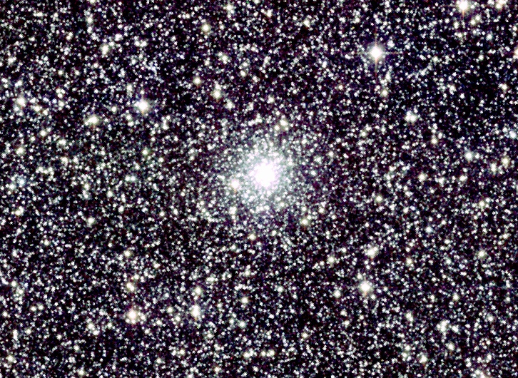

# General Information 🌍

The current repository is dedicated to demonstrating the application of the **citros_data_analysis**](https://citros.io/doc/docs_data_analysis) package using the example of star globular cluster orbit simulations.

Globular star clusters are gravitationally bound, dense and rich aggregations of stars, that can be found nearly in every galaxy, including our own Milky Way. In comparison with another type of star clusters, the open clusters, globular clusters are populated with older stars and can have up to millions of members.  Another notable difference is that they are not part of the disk component but belong to the halo. This means they can be located far from both the thin and thick disks of the Galaxy, which have thicknesses of about 300 pc and 2.6 kpc, respectively.



*globular star cluster NGC 6316, Atlas Image [or Atlas Image mosaic] obtained as part of the Two Micron All Sky Survey (2MASS), a joint project of the University of Massachusetts and the Infrared Processing and Analysis Center/California Institute of Technology, funded by the National Aeronautics and Space Administration and the National Science Foundation*.

For the calculations of the orbits, the Python package [GalOrb](https://github.com/ChemelAA/GalOrb-Package) was adopted. Details on this package, as well as parameters required for simulations, can be found in the article [Globular Clusters: Absolute Proper Motions and Galactic Orbits](https://link.springer.com/article/10.1134/S1990341318020049), [arXiv](https://arxiv.org/pdf/1804.07086.pdf).

# CITROS Usage

Please follow steps that are described in [Tutorial](https://citros.io/doc/blog/Cannon).

Briefly, to clone project and run it in CITROS cloud, the following steps are required:

- Clone github repository:
```bash
$ git clone git@github.com:citros-garden/cannon.git
$ cd ~/gal_orbits
```

- Build the project:
```bash
$ colcon build
$ source install/local_setup.bash
```

- Install CITROS:
```bash
$ pip install citros
```

- Log in:
```bash
$ citros login
```

- Set ssh key:
```bash
$ citros setup-ssh
```

- Initialization
```bash
$ citros init
```

- Build and push docker image
```bash
$ citros docker-build-push
```

- Set up parameters of the simulation:
check the [parameters](#parameter-setups) that are required for the orbits calculations. 

- Run in the cloud: set name of the batch, message and number of simulations, for example:
```bash
$ citros run -n "galactic orbits" -m "first run" -c 5 -r
```

## Parameter setups

Parameters for the simulation are listed in the following:

parameter | description
|--|--
rh| heliocentric distance of the object (in kpc)
lon| galactic longitude of the object (in degrees)
lat| galactic latitude of the object (in degrees)
vr| heliocentric radial velocity of the object (in 100 km/s)
pmra| proper motion in right ascention (in mas/year)
pmde| proper motion in declination| -3.70
t0| starting time of calculation (in units of 10^7 years)
tf| final time of calculation (in units of 10^7 years)
M_disc| mass of the disc, in Msun * 10^9, by default, 10^11 Msun
M_sph| mass of the spherical component of the Galaxy, in Msun*10^9, by default, 3 *10^10 Msun
reverse| if 'True', set backward direction of time, by default, direction is forward
rtol| relative value of the error of the numerical integration scheme, affects the output number of messages
atol| absolute value  of the error of the numerical integration scheme, affects the output number of messages

Parameters are listed in file [.citros/parameter_setups/default_param_setup.json](.citros/parameter_setups/default_param_setup.json). In case of the cluster **NGC 6316**:

```js
{
    "packages": {
        "gal_orbits": {
            "gal_orbits": {
                "ros__parameters": {
                    "publish_freq": 10.0,
                    "rh": 11.5,
                    "lon": 357.18,
                    "lat": 5.76,
                    "vr": 0.715,
                    "pmra": -4.52,
                    "pmde": -3.70,
                    "t0": 0.0,
                    "tf": 20.0,
                    "M_disc": {
                        "function": "my_func.py:return_next_value",
                        "args": [[95.0, 97.5, 100.0, 102.5, 105.0]]
                    },
                    "M_sph": 30.0,
                    "reverse": "False",
                    "rtol": 1e-8,
                    "atol": 1e-8
                }
            }
        }
    }
}
```

The table with the paramaters for the 115 globular clusters may be found in article, mentioned above: [Globular Clusters: Absolute Proper Motions and Galactic Orbits](https://link.springer.com/article/10.1134/S1990341318020049), [arXiv](https://arxiv.org/pdf/1804.07086.pdf).

Function *my_func.py:return_next_value* each simulation returns the next value, listed in "args". It is written in file [.citros/parameter_setups/functions/my_func.py](.citros/parameter_setups/functions/my_func.py):

```python
def return_next_value(arr, citros_context):
    return arr[citros_context['run_id']]
```